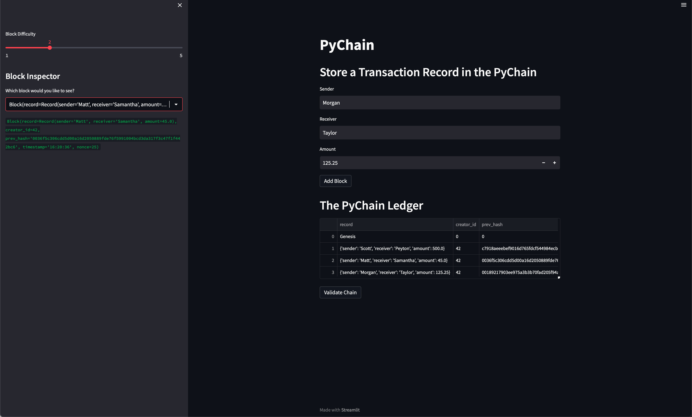
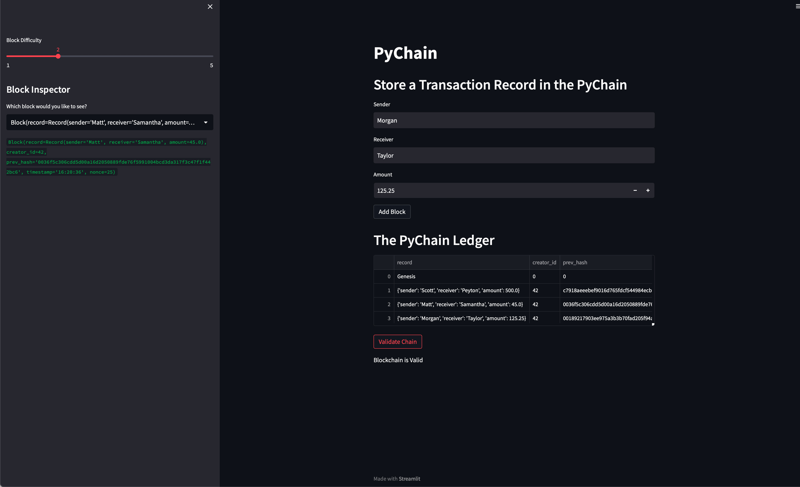

# module18_challenge

## Introduction
The focus of this challenge was build a blockchain-based ledger system with a Streamlit front-end.

## Technology
Python version 3.9.16 was used to develop the code for this challenge. Other versions of python may work, but no guarantee is made.
Streamlit version 1.21.0 was used for the front-end application. 

## Blockchain Contents

The image below shows the blockchain ledger with 3 entries made.

The image below shows that the blockchain is valid.
